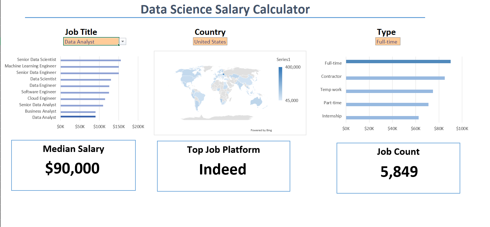
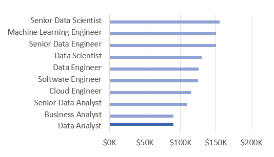
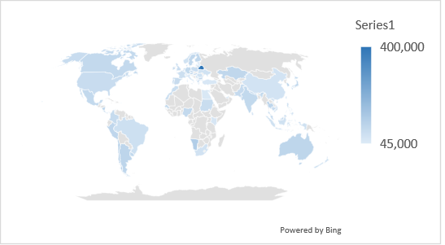

# Excel Salary Dashboard



## Introduction

This data jobs dashboard helped me explore which data career paths to focus on while teaching me foundational Excel data analysis skills. It was a part of an 11 hour excel boot camp course create by Luke Barousse, who gave in-depth instruction of all the skills used to create this dashboard and more. His youtube channel is linked below.

[Luke Barousse's Youtube Channel
]([https://www.youtube.com/@LukeBarousse
)
### Dashboard File
My final dashboard is in [1_Salary_Dashboard.xlsx](1_Salary_Dashboard.xlsx).

### Excel Skills Used

The following Excel skills were utilized for analysis:

- **Charts**
- **Formulas and Functions**
- **Data Validation**

### Data Jobs Dataset

The dataset used for this project, provided by Luke Barousse, contains real-world data science job information from 2023. It includes detailed information on:

- **Job titles**
- **Salaries**
- **Locations**
- **Skills**

## Dashboard Build

### Charts

#### Data Science Job Salaries - Bar Chart




- **Excel Features:** Utilized bar chart feature (with formatted salary values) and optimized layout for clarity.
- **Design Choice:** Horizontal bar chart for visual comparison of median salaries.
- **Data Organization:** Sorted job titles by descending salary for improved readability.
- **Insights Gained:** Enabled quick identification of salary trends, noting that Senior roles and Engineers are higher-paying than Analyst roles.

#### Country Median Salaries - Map Chart



- **Excel Features:** Utilized Excel's map chart feature to plot median salaries globally.
- **Design Choice:** Color-coded map to visually differentiate salary levels across regions.
- **Data Representation:** Plotted median salary for each country with available data.
- **Visual Enhancement:** Improved readability and immediate understanding of geographic salary trends.
- **Insights Gained:** Enabled quick grasp of global salary disparities and highlights high/low salary regions.

### Formulas and Functions

#### Median Salary by Job Titles

```
=MEDIAN(
IF(
    (jobs[job_title_short]=A2)*
    (jobs[job_country]=country)*
    (ISNUMBER(SEARCH(type,jobs[job_schedule_type])))*
    (jobs[salary_year_avg]<>0),
    jobs[salary_year_avg]
)
)
```

- **Multi-Criteria Filtering:** Checked job title, country, schedule type, and excludes blank salaries.
- **Array Formula:** Utilized `MEDIAN()` function with nested `IF()` statement to analyze an array.
- **Tailored Insights:** Provided specific salary information for job titles, regions, and schedule types.
- **Formula Purpose:** This formula populated the table below, returning the median salary based on job title, country, and type specified.


#### Count of Job Schedule Type

```
=FILTER(J2#,(NOT(ISNUMBER(SEARCH("and",J2#))+ISNUMBER(SEARCH(",",J2#))))*(J2#<>0))
```

- **Unique List Generation:** This Excel formula below employed the `FILTER()` function to exclude entries containing "and" or commas, and omit zero values.
- **Formula Purpose:** This formula populated the table below, which gives us a list of unique job schedule types.

### Data Validation

#### Filtered List

- **Enhanced Data Validation:** 
    - Used the filtered list to create drop-down menus for Job Title, Country, and Schedule Type
    - Prevents invalid user inputs and ensures consistent data entry
    - Improves overall dashboard usability


## Conclusion

I created this dashboard to learn new excel skills and showcase insights into salary trends across various data-related job titles. Utilizing data from Luke Barousse, this dashboard helped me gain a better insight into salaries associated with different data jobs. 
