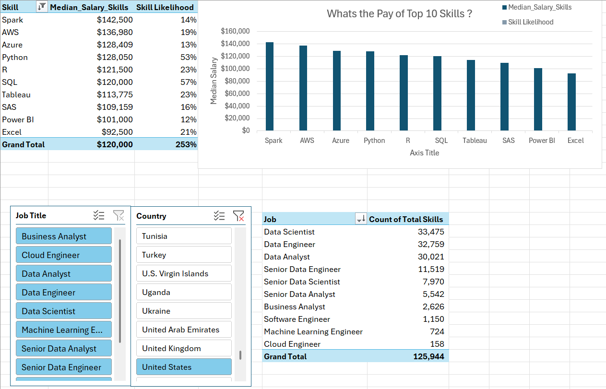

# Project 1: Salary Dashboard

This project is an interactive Excel dashboard that visualizes salary trends across **industry**, **job role**, and **experience level**. It helped me explore desired job paths while strengthening my Excel skills in dashboard design and formatting.

### Salary Dashboard
This dashboard allowed me to:
- Investigate salary expectations for target roles
- Practice data visualization in Excel
- Improve layout, interactivity, and formatting

[View the Dashboard](Project_1_Dashboard)

---

### Salary Analysis
This analysis focused on the role of **skills** in determining salary for data-related jobs. I used **Power Query** to clean and transform data, helping me understand which skills drive compensation in different roles.

[View the Analysis](Project_2_Analysis)

---

### Author
**Reid Westervelt**